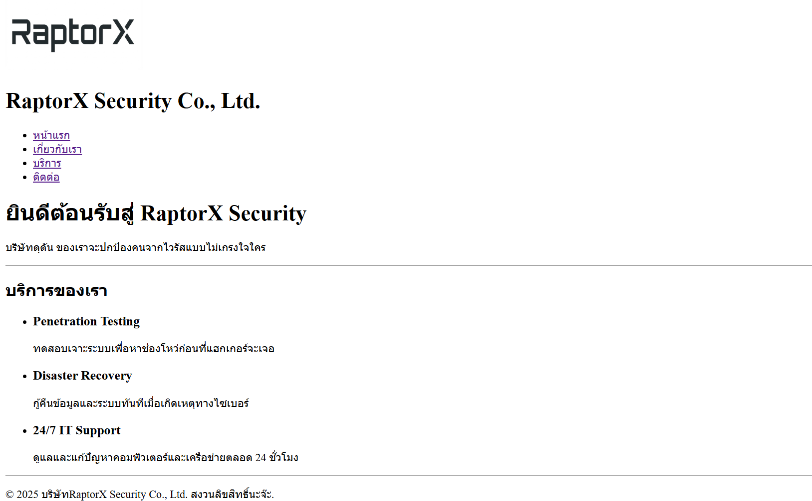
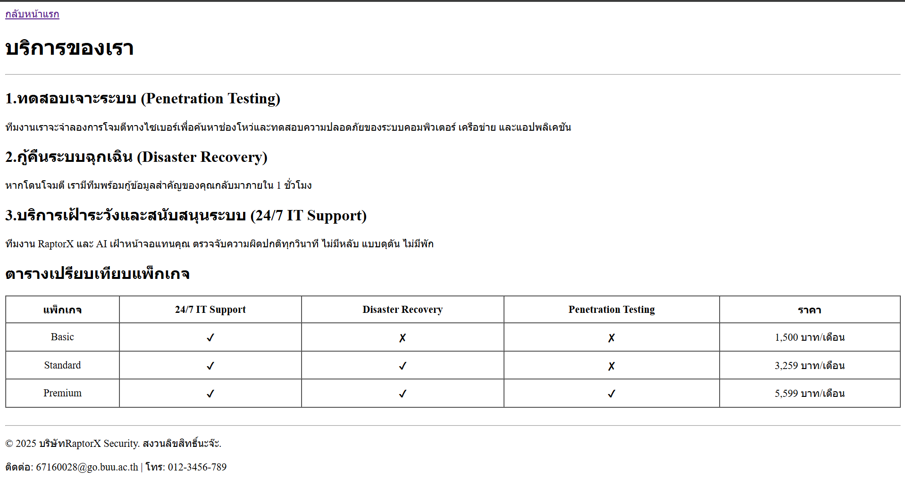
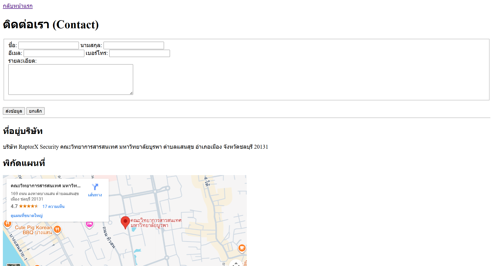

# RaptorX Security Website

โปรเจคเว็บไซต์สำหรับธุรกิจ **"RaptorX Security"** บริษัทรักษาความปลอดภัยทางไซเบอร์ที่มาพร้อมสโลแกน "ดุดัน ไม่เกรงใจใคร" ให้บริการด้านการป้องกัน ตรวจสอบ และกู้คืนระบบแบบครบวงจร

## ประกอบด้วย:

- **วิสัยทัศน์:** มุ่งสู่การเป็นผู้นำด้าน Cyber Security ที่ขับเคลื่อนด้วยเทคโนโลยี AI เพื่อปกป้องข้อมูลและระบบของลูกค้าอย่างชาญฉลาดและยั่งยืน
- **บริการ:** รายละเอียดบริการเจาะระบบ (Penetration Testing), การกู้คืนระบบฉุกเฉิน (Disaster Recovery) และการเฝ้าระวังภัย 24 ชั่วโมง
- **โครงสร้างราคา:** ตารางเปรียบเทียบแพ็กเกจบริการ
- **ทีมผู้บริหาร:** ข้อมูลบุคลากรระดับโลก
- **การติดต่อ:** แบบฟอร์มติดต่อภารกิจและแผนที่ที่ตั้งบริษัท

## ลิงก์เข้าสู่หน้าเว็บ

- [หน้าแรก](index.html)
- [เกี่ยวกับเรา](about.html)
- [บริการของเรา](services.html)
- [ติดต่อเรา](contact.html)

```text
my-business-web/
├── index.html
├── about.html
├── services.html
├── contact.html
├── styles.css
├── README.md
└── images/
    ├── logo.jpg
    ├── hero-bg.jpg
    ├── CEO-1.jpg
    ├── ...
    └── Screenshot-index.png
```

# เว็บไซต์ RaptorX Security (RaptorX Security Website)

## 🛡️ เกี่ยวกับโปรเจกต์ (About the Project)

โปรเจกต์นี้คือเว็บไซต์อย่างเป็นทางการของ **บริษัท RaptorX Security จำกัด** ผู้นำด้านความปลอดภัยไซเบอร์ยุคใหม่ที่ขับเคลื่อนด้วย AI

พันธกิจของเราคือการปกป้องข้อมูลดิจิทัลอย่างดุดันและไม่ประนีประนอม ภายใต้สโลแกน

> **“ดุดัน ไม่เกรงใจใคร”**

---

## 🌐 หน้าเว็บไซต์ (Website Pages)

| หน้า (Page)          | รายละเอียด                                  | ลิงก์           |
| -------------------- | ------------------------------------------- | --------------- |
| หน้าแรก (Home)       | Hero Section, บริการเด่น และพันธกิจบริษัท   | `index.html`    |
| เกี่ยวกับเรา (About) | ประวัติ, วิสัยทัศน์/พันธกิจ และทีมผู้บริหาร | `about.html`    |
| บริการ (Services)    | รายละเอียดบริการ และตารางเปรียบเทียบแพ็กเกจ | `services.html` |
| ติดต่อเรา (Contact)  | แบบฟอร์มติดต่อ, Google Maps และที่อยู่      | `contact.html`  |

---

## 📂 โครงสร้างไฟล์ (File Structure)

```text
my-business-web/
├── index.html
├── about.html
├── services.html
├── contact.html
├── styles.css
├── README.md
└── images/
    ├── logo.jpg
    ├── hero-bg.jpg
    ├── CEO-1.jpg
    └── Screenshot-index.png
```

---

# เว็บไซต์ RaptorX Security (RaptorX Security Website)

## 🛡️ เกี่ยวกับโปรเจกต์ (About the Project)

โปรเจกต์นี้คือเว็บไซต์อย่างเป็นทางการของ **บริษัท RaptorX Security จำกัด** ผู้นำด้านความปลอดภัยไซเบอร์ยุคใหม่ที่ขับเคลื่อนด้วย AI

พันธกิจของเราคือการปกป้องข้อมูลดิจิทัลอย่างดุดันและไม่ประนีประนอม ภายใต้สโลแกน

> **“ดุดัน ไม่เกรงใจใคร”**

---

## 🌐 หน้าเว็บไซต์ (Website Pages)

| หน้า (Page)          | รายละเอียด                                  | ลิงก์           |
| -------------------- | ------------------------------------------- | --------------- |
| หน้าแรก (Home)       | Hero Section, บริการเด่น และพันธกิจบริษัท   | `index.html`    |
| เกี่ยวกับเรา (About) | ประวัติ, วิสัยทัศน์/พันธกิจ และทีมผู้บริหาร | `about.html`    |
| บริการ (Services)    | รายละเอียดบริการ และตารางเปรียบเทียบแพ็กเกจ | `services.html` |
| ติดต่อเรา (Contact)  | แบบฟอร์มติดต่อ, Google Maps และที่อยู่      | `contact.html`  |

---

## 📂 โครงสร้างไฟล์ (File Structure)

```text
my-business-web/
├── index.html
├── about.html
├── services.html
├── contact.html
├── styles.css
├── README.md
└── images/
    ├── logo.jpg
    ├── hero-bg.jpg
    ├── CEO-1.jpg
    └── Screenshot-index.png
```

---

## CSS Checklist

เอกสารนี้ยืนยันว่าโปรเจกต์ได้ใช้งานคุณสมบัติ CSS ตามเกณฑ์ที่กำหนดครบถ้วนแล้ว

- [x] Universal Selector & Reset (`*`)
- [x] Element Selectors (`h1–h4`, `p`, `a`, `table`)
- [x] Class Selectors (`.hero`, `.card`, `.btn`)
- [x] ID Selectors (`#header`, `#footer`)
- [x] Pseudo-classes (`:hover`, `:nth-child`)
- [x] CSS Units (`px`, `rem`, `%`, `vh`)
- [x] Color Palette & Typography
- [x] Box Model (`padding`, `margin`, `border`)
- [x] Positioning (`sticky`, `fixed`)
- [x] Display & Layout (Flexbox, Grid Layout)
- [x] Hover Effects & Transitions
- [x] CSS Organization & Comments

---

## ลิงก์เข้าสู่หน้าต่างๆ:

[หน้าแรก](index.html)


[เกี่ยวกับเรา](about.html)


[บริการของเรา](services.html)


[ติดต่อเรา](contact.html)


**จัดทำโดย:**
ชื่อ-นามสกุล: นาย ณัฐวุฒิ รู้การนา
รหัสนักศึกษา: 67160028
